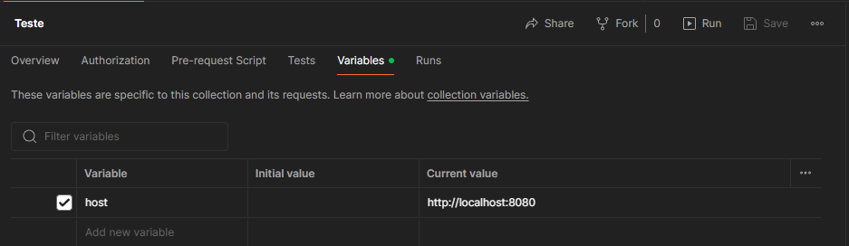
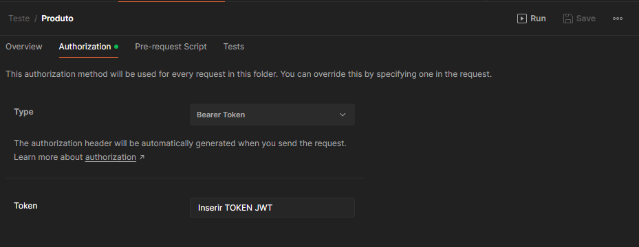

# E-commerce
Um CRUD completo de um e-commerce onde é possível cadastrar, atualizar, deletar e consultar produtos.


## Instalação
> Para executar o sistema primeiramente é necessário ter instalado em sua máquina o docker, você pode fazer a instalação seguindo as instruções nesse link [Docker](https://www.docker.com/).

Após a instalação do docker abra o terminal e acesse a pasta raiz do projeto em seguida execute o seguinte comando:
```sh
  docker compose up -d
```
    

## Configurações do Postman

Abra o Postman e import a collection ``Teste.postman_collection.json`` logo em seguida acesse a pasta Teste que foi criada e edite a váriavel ``host`` como aprensentado na imagem abaixo:



> Precione ``Crtl + S`` para salvar as alterações.

## Forma de uso

### Registrar

Para começar a utilizar o software é necessário realizar um cadastro de usuário dentro da pasta ``Autenticação`` no endpoint ``Registrar``".

    {
        "firstName": "Nome",
        "lastName": "Sobrenome",
        "email": "email",
        "password": "senha",
        "role": "permissão"
    }

- ``fisrt-name`` Primeiro nome do usuário.
- ``lastName`` Sobrenome do usuário.
- ``email`` Email válido do usuário.
- ``password`` Senha do usuário com no minímo 8 caracteres.
- ``role`` Permissão do usuário podendo ser:
- - ``USER`` Apenas permissão de leitura.
- - ``ADMIN`` Permissão de leitura e de editor.

### Autenticação

Nesse momento é necessário realizar a autenticação no endpoint ```Login```.

    {
        "email": "email",
        "password": "senha"
    }

- ``email`` Email que foi cadastrado.
- ``password`` Senha cadastrada.

Se essa etapa foi realizada com sucesso você irá receber um ``Bearer Token`` que será utilizado pra acessar os endpoints do ``Produto``.

### Acessar produto
Já com o token gerado acesse a pasta ```Produto``` e acesse a área de autorização selecione a opção ``Bearer Token`` e cole o token gerado.


> Precione ``Crtl + S`` para salvar as alterações.

## Produto Endpoints


- ``Cadastrar Categoria`` Regitrar uma nova categoria de produto.
- ``Visualizar Categorias`` Retorna todas as categorias cadastradas.
- ``Cadastrar Produto`` Registre um novo produto.
- ``Visualizar Produto`` Visualize um produto selecionado por seu ``id``.
- ``Visualizar Produtos Paginados`` Visualize os produtos cadastrados utilizando filtros de paginação.
- ``Atualizar Produto`` Atualize um produto selecionado por seu ``id``.
- ```Deletar Produto``` Delete um produto selecionado por seu ``id``.

## ✔️ Tecnologias utilizadas

- ``Java 17``
- ``Spring boot 3``
- ``Spring Security 6``
- ``Spring Gateway``
- ``Service discovery — Eureka``
- ``PostgreSQL``
- ``RabbitMQ``

Made with 🧡 by Tércio da Silva 🖐 [See my LinkedIn](https://www.linkedin.com/in/t%C3%A9rcio-da-silva-a5b385197/)
